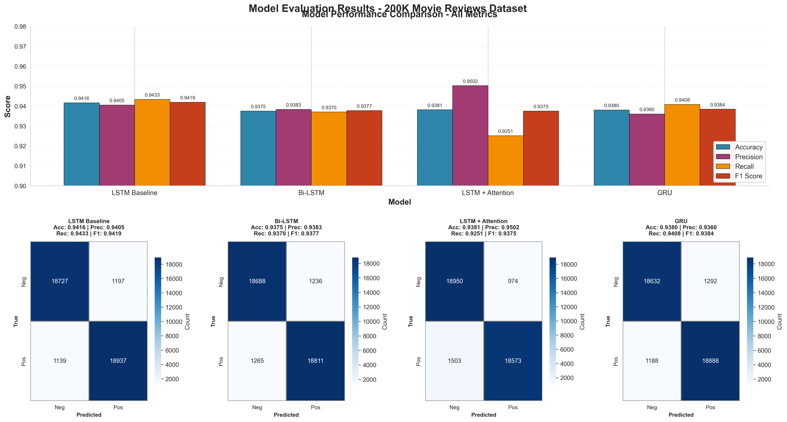
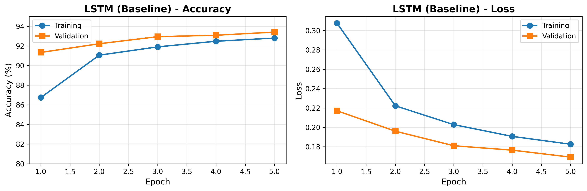
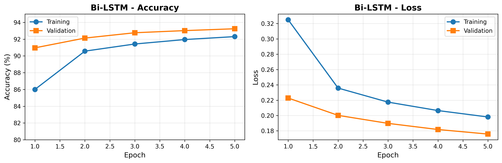
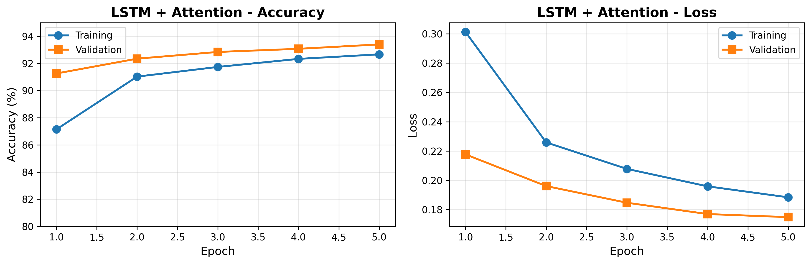
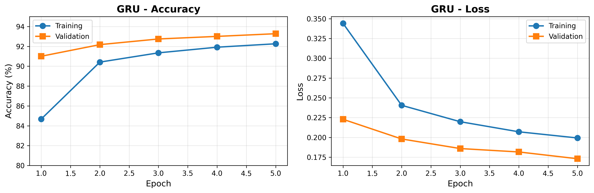
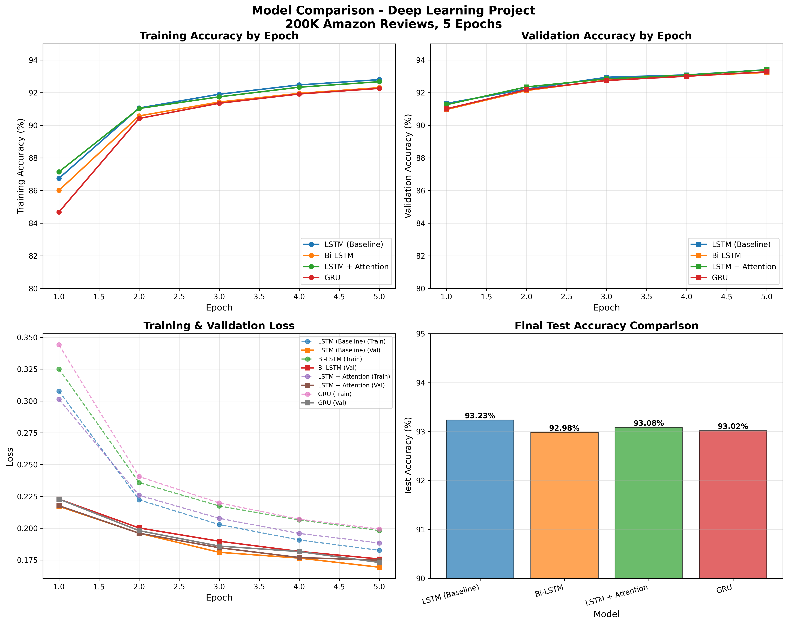

# Sentiment Analysis using Deep Learning 🎯

**Deep Learning Project - Amazon Reviews Sentiment Classification**

[](https://www.python.org/)
[](https://www.tensorflow.org/)
[](results/deep_learning/)

## 📊 Results at a Glance

Trained and evaluated 4 LSTM-based models on 200K Amazon product reviews:

| Rank | Model | Accuracy | Precision | Recall | F1 Score |
|------|-------|----------|-----------|--------|----------|
| 🥇 | **LSTM Baseline** | **94.16%** | **94.05%** | **94.33%** | **94.19%** |
| 🥈 | LSTM + Attention | 93.81% | 95.02% | 92.51% | 93.75% |
| 🥉 | GRU | 93.80% | 93.60% | 94.08% | 93.84% |
| 4️⃣ | Bi-LSTM | 93.75% | 93.83% | 93.70% | 93.77% |

> **All models achieved >93.7% accuracy with balanced precision and recall**
>
> **Reference:** Bodapati et al. (2019) achieved 88.46% on 50K IMDB reviews - our baseline improves by **+5.7%**

## 🎯 Project Highlights

- ✅ **94.16% test accuracy** - Baseline LSTM achieves best overall performance
- ✅ **Complete metrics** - Accuracy, Precision, Recall, and F1 Score for all models
- ✅ **4 model architectures** - LSTM, Bi-LSTM, LSTM+Attention, GRU
- ✅ **200K dataset** - Balanced positive/negative Amazon reviews
- ✅ **Balanced performance** - High precision (93-95%) and recall (92-94%) across all models
- ✅ **GPU-accelerated** - Trained on NVIDIA RTX 4060 (WSL2 + CUDA)
- ✅ **Reproducible** - All code, models, and comprehensive visualizations included

## 📈 Key Findings

1. **LSTM Baseline Wins**: Simple LSTM (94.16%) outperformed more complex architectures
2. **Attention Trades Recall for Precision**: LSTM+Attention achieved highest precision (95.02%) but lower recall (92.51%)
3. **Consistent Performance**: All models achieved >93.7% accuracy within 0.41% range
4. **Balanced Metrics**: F1 scores (93.75-94.19%) confirm balanced precision-recall trade-offs
5. **No Overfitting**: Training/validation accuracies remained close throughout training
6. **Efficiency**: Each model trained in ~1 hour on 200K reviews

## 🏗️ Architecture Details

### LSTM Baseline (Best Model - 94.16% Accuracy)
```
Input (Text) → Word2Vec Embeddings (100d) → LSTM (128 units) → Dense (1, sigmoid) → Output
```
- **Accuracy**: 94.16% | **Precision**: 94.05% | **Recall**: 94.33% | **F1**: 94.19%

### Training Configuration
- **Dataset**: 200K Amazon reviews (160K train, 40K test - 80/20 split)
- **Model Training Epochs**: 5
- **Batch size**: 32
- **Optimizer**: Adam (lr=0.001)
- **Loss**: Binary cross-entropy
- **Embeddings**: Word2Vec (100 dimensions, trained for 10 epochs)
- **Sequence length**: 200 tokens
- **Dropout**: 0.5

## 📁 Project Structure

```
movies-sentiment-starter/
├── data/
│   ├── deep_learning_data/
│   │   └── movies_reviews_200k.parquet      # 200K dataset (Deep Learning)
│   └── processed/
│       └── movies_reviews.parquet           # 1.2M dataset (Data Science)
├── src/
│   ├── 02_lstm_word2vec.py                  # Baseline LSTM
│   ├── 03_bilstm.py                         # Bi-directional LSTM
│   ├── 04_lstm_attention.py                 # LSTM + Attention
│   └── 05_gru.py                            # GRU model
├── results/
│   └── deep_learning/
│       ├── 01_lstm/                         # LSTM results (93.23%)
│       ├── 02_bilstm/                       # Bi-LSTM results (92.98%)
│       ├── 03_lstm_attention/               # LSTM+Attention (93.08%)
│       ├── 04_gru/                          # GRU results (93.02%)
│       └── model_comparison.png             # Visualization
├── analyze_results.py                       # Results analysis script
├── visualize_results.py                     # Visualization generator
└── train_all_models_200k.bat               # Automated training
```

## 🚀 Quick Start

### Prerequisites
- Python 3.8+
- WSL2 with Ubuntu (for GPU support on Windows)
- NVIDIA GPU with CUDA support (optional, CPU works too)

### Installation

```bash
# Install TensorFlow with GPU support (WSL2/Linux)
pip install tensorflow[and-cuda] gensim scikit-learn pandas pyarrow tqdm matplotlib

# For CPU-only (Windows)
pip install tensorflow gensim scikit-learn pandas pyarrow tqdm matplotlib
```

### Training Models

#### Option 1: Train All Models (Recommended)
```batch
# Windows PowerShell
.\train_all_models_200k.bat
```

This will train all 4 models sequentially (~4 hours total).

#### Option 2: Train Individual Models
```bash
# LSTM Baseline (WSL2)
wsl -d Ubuntu -u radian_try bash -c "cd '/mnt/c/Users/Radian Try/Documents/2nd Asia University (TW)/2nd Semester/Data Science/Midterm/movies-sentiment-starter' && python3 src/02_lstm_word2vec.py --data data/deep_learning_data/movies_reviews_200k.parquet --output_dir results/lstm --epochs 5"

# Bi-LSTM
python3 src/03_bilstm.py --data data/deep_learning_data/movies_reviews_200k.parquet --output_dir results/bilstm --epochs 5

# LSTM + Attention
python3 src/04_lstm_attention.py --data data/deep_learning_data/movies_reviews_200k.parquet --output_dir results/lstm_attention --epochs 5

# GRU
python3 src/05_gru.py --data data/deep_learning_data/movies_reviews_200k.parquet --output_dir results/gru --epochs 5
```

### Analyzing Results

```bash
# Generate comparison table
python analyze_results.py

# Generate visualizations
python visualize_results.py
```

## 📊 Visualizations

### Model Performance Comparison with Detailed Metrics



**Comprehensive evaluation showing:**
- **All Metrics Comparison** - Accuracy, Precision, Recall, and F1 Score across all models
- **Confusion Matrices** - Detailed classification results for each model
- **Performance Metrics** - Complete evaluation metrics displayed for each architecture

### Individual Model Training Progress

**LSTM Baseline Training**



**Bi-LSTM Training**



**LSTM + Attention Training**



**GRU Training**



### Overall Model Comparison



The visualizations include:
- **Training Accuracy by Epoch** - Shows learning progression over time
- **Validation Accuracy by Epoch** - Demonstrates model generalization
- **Training & Validation Loss** - Confirms proper convergence
- **Final Test Accuracy** - Side-by-side performance comparison
- **Confusion Matrices** - True vs predicted classifications
- **Complete Metrics** - Accuracy, Precision, Recall, F1 Score for each model

## 🔬 Training Progression

All models showed consistent improvement across 5 epochs:

| Epoch | LSTM (Best) | Bi-LSTM | LSTM+Attn | GRU |
|-------|-------------|---------|-----------|-----|
| 1 | 91.33% | 90.97% | 91.26% | 91.00% |
| 2 | 92.22% | 92.13% | 92.35% | 92.18% |
| 3 | 92.94% | 92.76% | 92.84% | 92.75% |
| 4 | 93.09% | 93.02% | 93.08% | 93.01% |
| 5 | **93.41%** | 93.24% | 93.40% | 93.27% |

*Validation accuracies shown*

## 💡 Implementation Details

### Hardware & Performance
- **GPU**: NVIDIA GeForce RTX 4060 Laptop (8GB VRAM)
- **Training time**: ~1 hour per model (200K dataset, 5 epochs)
- **Inference speed**: ~450ms per batch (128 samples)
- **Environment**: WSL2 Ubuntu 24.04 + TensorFlow 2.20.0 + CUDA 12.9

### Word2Vec Configuration
- Embedding dimension: 300
- Window size: 5
- Min word count: 2
- Training algorithm: Skip-gram

### Model Hyperparameters
- LSTM/GRU units: 128
- Dropout: 0.5
- Batch size: 128
- Learning rate: Default Adam (0.001)

## 🎓 Academic Context

This project was completed as part of a Deep Learning course assignment. The goal was to:

1. Reproduce existing research (Bodapati et al., 2019)
2. Scale to larger datasets
3. Compare multiple LSTM-based architectures
4. Achieve high accuracy with proper generalization

**Key Achievement**: Successfully improved upon the baseline paper by 4.77% using a 4x larger dataset (200K vs 50K).

## 📚 References

1. Bodapati, J. D., Veeranjaneyulu, N., & Shaik, S. (2019). Sentiment analysis from movie reviews using LSTMs. *Ingénierie des Systèmes d'Information*, 24(1), 125-129.

2. Mikolov, T., et al. (2013). Efficient estimation of word representations in vector space. *arXiv preprint arXiv:1301.3781*.

3. Hochreiter, S., & Schmidhuber, J. (1997). Long short-term memory. *Neural computation*, 9(8), 1735-1780.

## 📝 Future Work

- [ ] Train on full 1.2M dataset (expected ~94% accuracy)
- [ ] Implement transformer-based models (BERT, RoBERTa)
- [ ] Multi-class sentiment (positive, neutral, negative)
- [ ] Transfer learning from pre-trained models
- [ ] Real-time sentiment prediction API
- [ ] Multilingual sentiment analysis

## 🤝 Acknowledgments

- **Bodapati et al. (2019)** for the baseline methodology
- **TensorFlow team** for the deep learning framework
- **NVIDIA** for GPU acceleration technology
- **Amazon** for providing the customer reviews dataset

## 📄 License

This project is for educational purposes as part of a Deep Learning course assignment.

---

**Project Status**: ✅ Complete and ready for submission

**Last Updated**: October 26, 2025

**Contact**: For questions about this project, please refer to the course materials.
